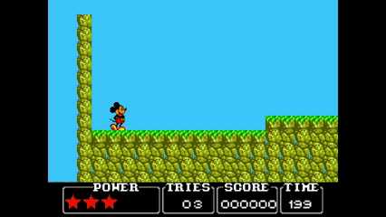
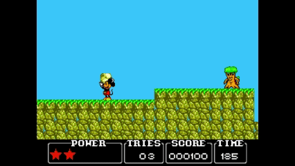
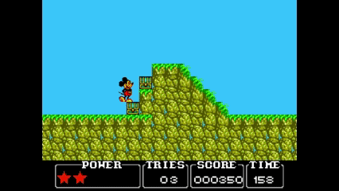
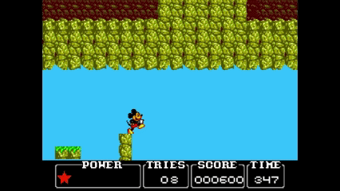

# 2D Project - VJ - UPC-FIB 2024/25 Q1

This project was developed as part of the **Video Games (VJ)** course at the **Faculty of Informatics of Barcelona (UPC-FIB)** during the **2024/25 Q1** term.
Game inspired by the *Castle of Illusion Starring Mickey Mouse* game released in 1991 for the Master System and Game Gear.
Implemented in C++ with OpenGL for the graphics and SDL for the audio.

Authors:  
- **Alvar Dalda**  
- **Liliu Martínez**

📢 This project is for educational purposes only. Since it is inspired by an existing game, it will not be commercialized, and no economic profit will be obtained from it.
